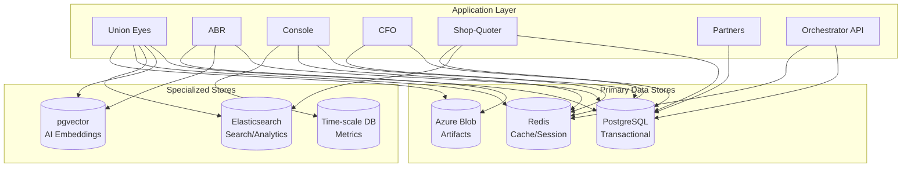

# Nzila OS — Polyglot Persistence Architecture

> **Status**: Design Document  
> **Version**: 1.1  
> **Last Updated**: 2026-02-26

---

## 1. Executive Summary

This document outlines a polyglot persistence architecture for Nzila OS. The current architecture uses primarily PostgreSQL via two ORM layers (Django ORM for Union Eyes/ABR, Drizzle for TS-authoritative apps). This design proposes expanding to specialized data stores to optimize for different data access patterns while maintaining data consistency and governance.

---

## 2. Current State Analysis

### 2.1 Existing Data Stores

| Layer | Technology | Purpose | Apps Using |
|-------|------------|---------|------------|
| **Primary DB** | PostgreSQL (Drizzle) | TS-authoritative apps | console, cfo, partners, shop-quoter, nacp-exams, zonga, orchestrator-api |
| **Secondary DB** | PostgreSQL (Django ORM) | Django-authoritative apps | union-eyes, abr |
| **Cache/Session** | Redis (ioredis, @upstash/redis, django-redis) | Cache, Celery broker, rate limiting | union-eyes |
| **Vector** | pgvector (PostgreSQL extension) | AI embeddings, RAG chunk storage | ai-core (via `ai_embeddings` table, HNSW index) |
| **Blob Storage** | Azure Blob | Evidence, artifacts, uploads | All apps |
| **Auth** | Clerk | Authentication | All apps |

> **Note**: Redis and pgvector are already in production but scoped to individual apps.
> This design proposes **centralizing** them into shared packages (`@nzila/redis`, `@nzila/search`).

### 2.2 Data Access Patterns

| App | Domain Data | Query Pattern | Write Pattern | Special Needs |
|-----|-------------|----------------|---------------|---------------|
| **union-eyes** | Cases, grievances, bargaining, compliance | Complex joins, relationships | High-frequency mutations | AI embeddings, full-text search |
| **abr** | Similar to union-eyes | Complex joins | High-frequency | AI embeddings |
| **console** | Governance, finance, ML | Aggregations, reports | Transactional | ML model storage |
| **cfo** | Financial data | Audit queries | ACID critical | Audit trails |
| **shop-quoter** | Products, orders, invoices | CRUD, search | E-commerce scale | Full-text product search |
| **partners** | Entitlements, entities | Relationship queries | Low volume | Partner isolation |
| **orchestrator-api** | API orchestration | Routing, aggregation | Low-medium | Rate limiting, correlation IDs |
| **analytics** *(package)* | Metrics, aggregations | Heavy read/aggregation | Batch | Time-series patterns |

---

## 3. Proposed Polyglot Architecture

### 3.1 Data Store Selection Matrix



### 3.2 Store Specifications

| Data Store | Technology | Use Case | Schema Approach |
|------------|------------|-----------|------------------|
| **Transactional** | PostgreSQL + Drizzle | Core domain data, entities, relationships | Strongly typed Drizzle schemas |
| **Cache/Session** | Redis | Session data, rate limiting, real-time data | Key-value |
| **Search** | Elasticsearch | Full-text search, analytics queries | Index mappings |
| **Vector** | pgvector (PostgreSQL extension) | AI embeddings, similarity search | Vector columns |
| **Time-series** | TimescaleDB or PostgreSQL + pg_cron | Metrics, audit logs, analytics | Hypertables |
| **Blob** | Azure Blob Storage | Evidence packs, documents, images | Flat namespace |

---

## 4. Implementation Recommendations

### 4.1 Phase 1: Centralize Redis into `@nzila/redis` (High Impact, Low Risk)

**Current State**: Redis is already in production in `union-eyes` (ioredis, @upstash/redis,
django-redis as Celery broker, Azure Cache provisioned in `apps/union-eyes/infra/main.bicep`).
However, usage is app-specific with no shared abstraction.

**Goal**: Extract a shared `packages/redis/` package so all apps can consume Redis
through a single, governed interface with mandatory TTLs and org-scoped key prefixes.

**Use Cases**:
- Session caching for Clerk tokens
- Rate limiting per-org
- Real-time UI updates (presence, notifications)
- Temporary computation results

**Integration**:
```typescript
// packages/redis/src/index.ts
import { createClient, type RedisClientType } from 'redis';

export function createRedisClient(url = process.env.REDIS_URL): RedisClientType {
  return createClient({ url, socket: { reconnectStrategy: (retries) => Math.min(retries * 100, 5000) } });
}

// All writes MUST include a TTL — enforced by contract test STACK_POLYGLOT_002
export async function setWithTTL(redis: RedisClientType, key: string, value: string, ttlSeconds: number) {
  if (ttlSeconds <= 0) throw new Error('Redis writes must include a positive TTL');
  await redis.setEx(key, ttlSeconds, value);
}

// Key convention: org:{orgId}:{domain}:{id}
export function orgKey(orgId: string, domain: string, id: string): string {
  return `org:${orgId}:${domain}:${id}`;
}
```

### 4.2 Phase 2: Add Elasticsearch for Search (Medium Impact)

**Rationale**: Full-text search across union-eyes cases, grievances, shop-quoter products.
PostgreSQL `TSVECTOR` is currently used in Django apps but does not scale to cross-app
faceted search or analytics aggregations.

**Use Cases**:
- Case document search
- Product catalog search
- Analytics aggregations
- Compliance document search

**Tenant Isolation Strategy**: Use a **shared index per document type** with an `orgId` field
and filtered aliases (e.g., `cases-org-{orgId}`), rather than index-per-tenant which
creates operational overhead at scale.

**Integration**:
```typescript
// packages/search/src/index.ts  (published as @nzila/search)
export interface SearchableDocument {
  id: string;
  type: 'case' | 'product' | 'grievance';
  orgId: string;
  title: string;
  content: string;
  metadata: Record<string, unknown>;
}

// Shared index + filtered alias for tenant isolation
export async function indexDocument(client: Client, doc: SearchableDocument) {
  return client.index({
    index: `nzila-${doc.type}`,          // shared index
    id: doc.id,
    document: { ...doc },                // orgId field used for alias filtering
    routing: doc.orgId,                   // co-locate org shards
  });
}

// Org-scoped alias created on first access
export async function ensureOrgAlias(client: Client, orgId: string, docType: string) {
  const aliasName = `${docType}-org-${orgId}`;
  await client.indices.putAlias({
    index: `nzila-${docType}`,
    name: aliasName,
    filter: { term: { orgId } },
  });
}
```

### 4.3 Phase 3: Standardize pgvector Usage Across Apps (High Value)

**Current State**: pgvector is **already implemented**:
- `packages/db/src/schema/ai.ts` defines the `ai_embeddings` table with `entity_id`, `app_key`,
  `source_id`, `chunk_id`, `chunk_text`, and an `embedding` column (text placeholder, migrated
  to `vector(1536)` via `packages/db/migrations/ai-control-plane-pgvector.sql`)
- HNSW index (m=16, ef_construction=64) for cosine similarity is already created
- `tooling/ai-evals/ingest-rag.ts` provides a working RAG ingestion pipeline
- `packages/ai-core/src/rag/chunker.ts` implements deterministic text chunking with SHA-256 IDs

**Goal**: Standardize and extend vector usage across all apps that need semantic search,
not introduce pgvector from scratch.

**Use Cases**:
- Clause precedent matching (union-eyes, abr)
- Case similarity search
- RAG (Retrieval-Augmented Generation)
- Semantic document matching
- Cross-app knowledge retrieval

**Existing Schema** (already in `packages/db/src/schema/ai.ts`):
```typescript
export const aiEmbeddings = pgTable('ai_embeddings', {
  id: uuid('id').primaryKey().defaultRandom(),
  entityId: uuid('entity_id').notNull().references(() => entities.id),
  appKey: varchar('app_key', { length: 60 }).notNull(),
  sourceId: uuid('source_id').notNull().references(() => aiKnowledgeSources.id),
  chunkId: varchar('chunk_id', { length: 255 }).notNull(),
  chunkText: text('chunk_text').notNull(),
  embedding: text('embedding'),  // migrated to vector(1536) via SQL migration
  metadata: jsonb('metadata').default({}),
  createdAt: timestamp('created_at', { withTimezone: true }).notNull().defaultNow(),
});
```

**Remaining Work**:
1. Expose a high-level `@nzila/ai-core` API for apps to embed + query without touching raw SQL
2. Add Django-side embedding helpers for union-eyes/abr to write embeddings via the shared table
3. Add contract test to ensure all embedding writes go through the governed pipeline

### 4.4 Phase 4: Time-Series Optimization (Future)

**Rationale**: Audit logs, metrics, and analytics have time-series characteristics.

**Use Cases**:
- Audit event queries by time range
- Usage metrics aggregation
- Performance monitoring
- Compliance reporting

---

## 5. Data Consistency Patterns

> **Prerequisite**: The current event bus (`packages/commerce-events/src/event-bus.ts`) is
> **in-memory only** and provides no durability guarantees. Before adopting multi-store
> consistency patterns, the bus must be migrated to an **outbox-backed** or **Azure Service Bus**
> implementation to ensure at-least-once delivery. The existing code includes a comment
> acknowledging this: *"Designed to be swapped for an outbox-backed or Azure Service Bus
> implementation."*

### 5.1 Event Sourcing for Cross-Store Consistency

When data spans multiple stores, use event sourcing:

```typescript
// Create domain event
interface DomainEvent<T> {
  id: string;
  type: string;
  payload: T;
  timestamp: Date;
  orgId: string;
}

// Event handler dispatches to multiple stores
async function handleOrderCreated(event: DomainEvent<OrderCreated>) {
  // 1. Write to PostgreSQL (source of truth)
  await ordersDb.insert(event.payload);
  
  // 2. Index in Elasticsearch for search
  await searchClient.index({
    index: 'orders',
    id: event.payload.id,
    document: event.payload,
  });
  
  // 3. Cache in Redis for fast retrieval
  await redis.setex(`order:${event.payload.id}`, 3600, JSON.stringify(event.payload));
  
  // 4. Emit event for other services
  await eventBus.publish(event);
}
```

### 5.2 Saga Pattern for Distributed Transactions

The saga pattern is **already implemented** in `packages/commerce-events/src/saga.ts`
(207 lines) with sequential step execution, automatic compensation on failure, and
`SagaExecution` audit records. The `shop-quoter` app already consumes `@nzila/commerce-events`.

Usage with the existing implementation:

```typescript
import { Saga } from '@nzila/commerce-events';

// Example: Order placement saga (uses existing Saga orchestrator)
async function placeOrderSaga(order: Order) {
  const saga = new Saga([
    {
      name: 'reserveInventory',
      execute: () => inventoryService.reserve(order.items),
      compensate: () => inventoryService.release(order.items),
    },
    {
      name: 'processPayment',
      execute: () => paymentService.charge(order.payment),
      compensate: () => paymentService.refund(order.payment),
    },
    {
      name: 'createOrder',
      execute: () => ordersDb.insert(order),
      compensate: () => ordersDb.delete(order.id),
    },
  ]);
  
  return saga.execute();  // auto-compensates on failure
}
```

---

## 6. Governance & Enforcement

### 6.1 Updated Stack Authority Rules

| App | Primary Authority | Secondary Stores Allowed |
|-----|-------------------|--------------------------|
| **union-eyes** | PostgreSQL (Django) | Elasticsearch, pgvector, Redis |
| **abr** | PostgreSQL (Django) | Elasticsearch, pgvector, Redis |
| **console** | PostgreSQL (Drizzle) | Redis, TimescaleDB |
| **cfo** | PostgreSQL (Drizzle) | Redis |
| **shop-quoter** | PostgreSQL (Drizzle) | Elasticsearch, Redis |
| **partners** | PostgreSQL (Drizzle) | Redis |
| **orchestrator-api** | PostgreSQL (Drizzle) | Redis |

### 6.2 Contract Tests

Add new invariant tests:

```typescript
// tooling/contract-tests/polyglot-authority.test.ts
describe('Polyglot Authority Invariants', () => {
  test('STACK_POLYGLOT_001: Apps must not bypass primary store for domain mutations', () => {
    // Verify domain data always written to PostgreSQL first
  });
  
  test('STACK_POLYGLOT_002: Redis usage must have TTL', () => {
    // Verify all Redis writes include expiration
  });
  
  test('STACK_POLYGLOT_003: Elasticsearch indices must use shared index with orgId field', () => {
    // Verify tenant isolation via filtered aliases, not index-per-tenant
  });

  test('STACK_POLYGLOT_004: Embedding writes must go through ai_embeddings table', () => {
    // Verify no ad-hoc vector columns outside the governed schema
  });
});
```

---

## 7. Migration Path

### 7.1 Immediate Actions (1-2 Sprints)

1. **Centralize Redis** into `packages/redis/` (`@nzila/redis`)
   - Extract existing union-eyes Redis usage into shared package
   - Enforce TTL-on-all-writes via contract test `STACK_POLYGLOT_002`
   - Migrate union-eyes ioredis/@upstash imports to `@nzila/redis`

2. **Migrate event bus** to outbox-backed delivery
   - Prerequisite for safe multi-store consistency patterns
   - Swap in-memory `commerce-events` bus for durable implementation

### 7.2 Short-Term (1-2 Quarters)

3. **Add Elasticsearch** for search capabilities
   - Requires new indexing pipelines
   - Start with shop-quoter product search as pilot
   - Use shared-index + filtered-alias tenant isolation

4. **Standardize pgvector** across apps
   - Expose high-level embedding API from `@nzila/ai-core`
   - Add Django-side helpers for union-eyes/abr
   - Contract test `STACK_POLYGLOT_004` for governed embedding writes

### 7.3 Long-Term (Future)

5. **Evaluate TimescaleDB** for time-series workloads
6. **Consider document database** if JSON-heavy schemas grow

---

## 8. Summary

| Store | Priority | Complexity | Value | Current Status |
|-------|----------|------------|-------|----------------|
| Redis | P0 | Low | High | **In production** (union-eyes only) — needs centralization |
| Event bus durability | P0 | Medium | Critical | **In-memory only** — prerequisite for multi-store patterns |
| Elasticsearch | P1 | Medium | High | Not yet present |
| pgvector | P1 | Low | High | **In production** (ai_embeddings + HNSW) — needs standardization |
| TimescaleDB | P2 | Medium | Medium | Not yet present |

This architecture maintains PostgreSQL as the single source of truth while leveraging specialized stores for specific access patterns. All data remains organization-isolated, and the existing governance framework (contract tests, ESLint rules) is extended to enforce polyglot patterns.

---

## 9. Next Steps

1. Review this design with the platform team
2. Scaffold `packages/redis/` and migrate union-eyes Redis usage to `@nzila/redis`
3. Implement outbox-backed event bus in `packages/commerce-events/`
4. Create RFC for Elasticsearch indexing strategy (shared-index + filtered-alias pattern)
5. Expose high-level embedding API from `@nzila/ai-core` for cross-app vector search
6. Deploy contract tests (`tooling/contract-tests/polyglot-authority.test.ts`)
