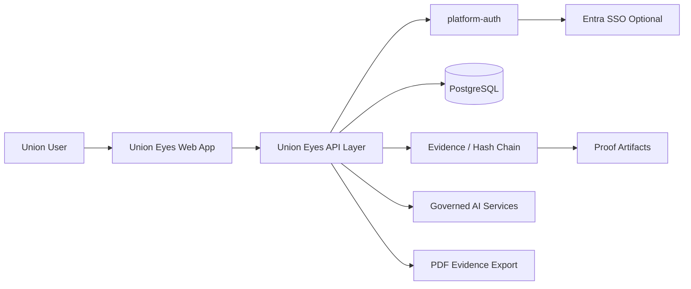

# Architecture Diagram

```mermaid
flowchart LR
  User[Union User] --> Web[Union Eyes Web App]
  Web --> API[Union Eyes API Layer]
  API --> Auth[platform-auth]
  API --> DB[(PostgreSQL)]
  API --> Evidence[Evidence / Hash Chain]
  API --> AI[Governed AI Services]
  API --> Export[PDF Evidence Export]
  Auth --> Entra[Entra SSO Optional]
  Evidence --> Proof[Proof Artifacts]
```

Reference architecture details:

- ARCHITECTURE.md
- docs/platform/platform-boundaries.md
