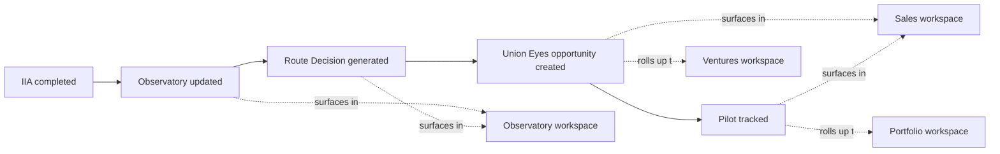

# Nzila Console — Workspace Map

> Status: **v1 — Foundational**
> Companion docs: [Workspace Doctrine](./NZILA_CONSOLE_WORKSPACE_DOCTRINE.md) · [Tab Schema](./NZILA_CONSOLE_TAB_SCHEMA.md) · [Telemetry Schema](./NZILA_CONSOLE_TELEMETRY_SCHEMA.md)

This document is the plug-in map: how ventures, engines, signals, and the existing
`(dashboard)` routes connect into the six Console workspaces. It is the answer to
*"where does this belong?"* for anything added to Nzila OS.

---

## 1. Top-level surface

```
Nzila Console  (apps/console → /workspace)
 ├── Overview
 ├── Portfolio   → Overview · Ventures · Pipeline · Funding
 ├── Observatory → Cohorts · Assessments · Route Decisions · Reassessments · Benchmark Readiness
 ├── Sales       → Leads · Opportunities · Proposals · Pilots · Conversions
 ├── Ventures    → (venture cards)
 ├── Operations  → Tasks · Risks · Decisions · Governance · Documentation
 └── Settings
```

---

## 2. The cross-workspace flow

The whole point of Console is to make this end-to-end flow visible from one surface:



| Stage | Owning workspace | Surfaced sub-tab |
| --- | --- | --- |
| IIA completed | Observatory | Assessments |
| Observatory updated | Observatory | Cohorts / Assessments |
| Route Decision generated | Observatory | Route Decisions |
| Opportunity created | Sales | Opportunities |
| Pilot tracked | Sales | Pilots |
| Conversion | Sales → Portfolio/Ventures | Conversions → Pipeline |

---

## 3. Venture → workspace mapping

Strategic ventures are surfaced in the **Ventures** workspace and rolled up in
**Portfolio**. Each strategic venture maps to one or more underlying catalog products
(`governance/portfolio/product-catalog.json`).

| Strategic venture | Catalog product id(s) | Stage signal source |
| --- | --- | --- |
| Union Eyes | `union-eyes` | catalog status + deal-engine (`union-eyes`) |
| TrustCore | `trustcore`, `trustcore-trustops` | catalog status |
| Institutional Intelligence | (Observatory program) | Observatory schema |
| Health | `veridian-site`, `veridian-care`, `veridian-admin` | catalog status |
| Civic | *(future)* | structural |
| Education | `nacp-exams` | catalog status |

> Adding a venture = adding a row here + a card in the Ventures workspace. It does **not**
> mean adding a new top-level Console tab.

---

## 4. Data-source map

| Source | Path | Feeds |
| --- | --- | --- |
| Portfolio catalog | `governance/portfolio/product-catalog.json` | Overview, Portfolio, Ventures |
| Deal Engine | `packages/deal-engine` | Overview, Portfolio (Pipeline), Sales, Ventures (revenue/customers) |
| Observatory schema | `migrations/0031_institutional_intelligence_observatory_tables.sql` | Observatory |
| Existing dashboard routes | `apps/console/app/(dashboard)/*` | Operations (links/frames) |

---

## 5. Existing route subordination

Console does not delete the existing 60+ `(dashboard)` routes. It subordinates them:
each legacy route is reachable, and is progressively framed inside a workspace sub-tab.

| Legacy route | Subordinated under |
| --- | --- |
| `/portfolio` | Portfolio → Overview |
| `/revenue`, `/ue-revenue-cockpit`, `/ue-pipeline` | Sales |
| `/risk` | Operations → Risks |
| `/governance`, `/board` | Operations → Governance |
| `/audit`, `/decision-scoreback` | Operations → Decisions |
| `/execution`, `/accountability` | Operations → Tasks |
| `/docs` | Operations → Documentation |
| `/settings` | Settings |

Routes not yet mapped remain reachable directly and are candidates for future
subordination — but no new top-level workspace is created for them.

---

## 6. Rules for "where does this belong?"

1. Is it a **new venture**? → Ventures card + a row in §3. Not a new tab.
2. Is it a **market-validation signal** (assessment, route, cohort)? → Observatory sub-tab.
3. Is it a **revenue motion** (lead, deal, pilot, conversion)? → Sales sub-tab.
4. Is it a **founder action** (task, risk, decision, governance, doc)? → Operations sub-tab.
5. Is it a **portfolio roll-up** (health, funding, pipeline summary)? → Portfolio sub-tab.
6. None of the above? → It probably does not belong in Console v1. Park it; revisit in v2.
