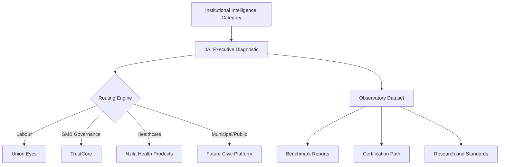

# Institutional Intelligence Product Architecture

<!--
  ARTIFACT TYPE: Portfolio Architecture and GTM Control Map
  DOCTRINE_VERSION: 1.1.0-draft
  CHANGE CLASS: Standard - requires doctrine + product review.
  CANONICAL REFERENCE: docs/doctrine/INSTITUTIONAL_INTELLIGENCE_CANONICAL_PACKAGE.md
-->

> Strategic decision: Nzila adopts Option B.
> IIA is a category-entry and routing product, not the long-term core revenue product.

---

## 1. Decision Statement

Nzila will operate Institutional Intelligence as a portfolio architecture:
1. Category authority at the top.
2. IIA as the executive diagnostic entry point.
3. Product routing into vertical operating systems where revenue scales.

This prevents GTM confusion, avoids product cannibalization, and keeps software products as primary revenue engines.

---

## 2. Portfolio Logic

### Category -> Assessment -> Routing -> Product

### Strategic posture
- IIA is the MRI machine.
- Vertical products are treatment systems.
- Revenue concentration target stays in products, not diagnostics.

---

## 3. Revenue Hierarchy (Target)

1. Union Eyes
2. TrustCore
3. Future vertical platforms (healthcare, municipal, other)
4. IIA workshops and reassessments
5. Certification (later-stage)

### Revenue policy
- IIA pricing should cover delivery cost, create case studies, and qualify product fit.
- IIA should not become a consulting-heavy growth trap.

---

## 4. Product Roles and Boundaries

| Layer | Primary Role | What it does | What it does not do |
|---|---|---|---|
| Institutional Intelligence | Category and authority layer | Defines problem, model, language, standards | Does not implement workflows directly |
| IIA | Diagnostic and qualification layer | Baselines fragility, maturity, and priorities | Does not replace operating products |
| Union Eyes | Labour operating layer | Grievance continuity, steward workflows, member service continuity, officer transition support | Not a generic cross-sector diagnostic |
| TrustCore | SMB governance layer | Governance discipline and continuity for SMB contexts | Not a labour-specific workflow platform |
| Future vertical products | Sector treatment layers | Domain-specific institutional continuity systems | Not category umbrella |

---

## 5. Routing Engine Rules

Mandatory scoring control:
- `docs/doctrine/programs/INSTITUTIONAL_INTELLIGENCE_PRODUCT_QUALIFICATION_MATRIX.md`

### Route to IIA first when primary pain is
1. Leadership transition risk
2. Governance fragility and inconsistency
3. Institutional memory loss
4. Trust erosion at executive or board level
5. AI governance readiness and accountability risk

### Route to Union Eyes first when labour operational pain is dominant
1. Grievance and case continuity breakdown
2. Steward or LRO workflow failure
3. Member service inconsistency
4. Officer-cycle handoff failure
5. Bargaining memory loss in live operations

### Hybrid path
1. Run IIA baseline for executive risk framing.
2. Route to Union Eyes for labour operating implementation.

---

## 6. Non-Cannibalization Guardrails

1. Always position IIA as the executive diagnostic umbrella.
2. Never pitch Union Eyes as a replacement for IIA.
3. Never pitch IIA as a substitute for labour operating implementation.
4. Route by dominant problem type, not by preferred product.
5. Keep proposal language consistent across sales, delivery, and post-workshop upsell.

---

## 7. Observatory, Research, and Certification Stack

IIA creates structured data exhaust that powers the institute layer:
1. Observatory: anonymized benchmark corpus by sector and maturity profile.
2. Research: recurring insight reports on fragility and resilience patterns.
3. Certification: later-stage designation framework built on baseline and trend evidence.

Canonical observatory data model:
- `docs/doctrine/programs/INSTITUTIONAL_INTELLIGENCE_OBSERVATORY_SCHEMA.md`

Observatory governance standards:
- `docs/doctrine/programs/OBSERVATORY_DATA_COLLECTION_STANDARD.md`
- `docs/doctrine/programs/OBSERVATORY_OPERATING_MODEL.md`
- `docs/doctrine/programs/FIRST_BENCHMARK_REPORT_SPEC.md`

This stack increases category gravity while product layers capture scalable revenue.

---

## 8. Operating Metrics

### Category-entry metrics
1. Number of IIA engagements completed
2. Baseline score distribution by sector
3. Case-study conversion count (paid or semi-paid)

### Routing metrics
1. IIA-to-product conversion rate overall
2. IIA-to-Union Eyes conversion rate for labour
3. IIA-to-TrustCore conversion rate for SMB governance

### Revenue mix metrics
1. Product revenue share vs workshop revenue share
2. Gross margin by layer
3. Time from IIA readout to product decision

### Quality metrics
1. Leadership acceptance rate of IIA findings
2. 90-day plan completion rate
3. Reassessment completion rate at 6-12 months

---

## 9. Initial Pilot Motion (Current)

Primary case-study targets:
1. CUPE4373 / Brandon
2. UNA / Heather unit context
3. Friendly association or non-profit leader

Pilot objective:
1. Secure three paid or semi-paid baselines.
2. Capture anonymized patterns and quotes by consent.
3. Produce first Observatory cohort snapshot.
4. Convert qualified contexts into the correct product pathway.

---

## 10. Practical Operating Rule

IIA is a category-entry product.
It is essential, monetized, and repeatable, but not the terminal business model.

Nzila scales when diagnostics consistently route institutions into durable vertical operating systems.
