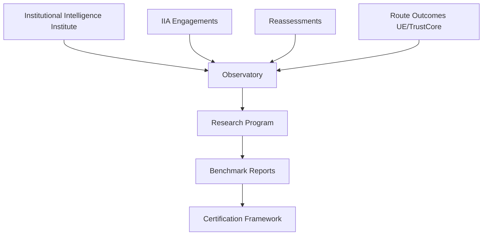

# Observatory Operating Model

<!--
  ARTIFACT TYPE: Institute Operating Model
  DOCTRINE_VERSION: 1.1.0-draft
  CHANGE CLASS: Standard - doctrine + product + governance review.
  CANONICAL REFERENCE: docs/doctrine/INSTITUTIONAL_INTELLIGENCE_CANONICAL_PACKAGE.md
-->

> This model defines how the Institutional Intelligence Institute functions across Observatory, Research, Benchmarks, and Certification.

---

## 1. Structural Model

Core principle:
- Institute sets standards.
- Observatory governs data.
- Research interprets patterns.
- Benchmarks publish cohort truth.
- Certification is built only after sufficient data maturity.

---

## 2. Functional Units and Responsibilities

## 2.1 Institute Governance
1. Maintains doctrine and methodological integrity.
2. Approves observatory standards and changes.
3. Resolves conflicts between commercial pressure and data ethics.

## 2.2 Observatory Unit
1. Owns schema, collection standards, and data quality.
2. Enforces consent, de-identification, and eligibility controls.
3. Produces benchmark-ready datasets.

## 2.3 Research Unit
1. Produces analysis narratives from benchmark datasets.
2. Publishes pattern reports and longitudinal insights.
3. Documents limitations and confidence levels.

## 2.4 Benchmark Publication Unit
1. Converts research output into publishable benchmark reports.
2. Applies threshold checks and suppression rules.
3. Maintains report version history.

## 2.5 Certification Design Unit (future state)
1. Defines designation criteria informed by observed cohort data.
2. Validates reliability before any certification launch.
3. Keeps certification separate from immediate sales incentives.

---

## 3. Decision Rights

| Decision Type | Primary Owner | Required Review |
|---|---|---|
| Schema change | Observatory Unit | Institute Governance |
| Collection standard change | Observatory Unit | Institute Governance |
| Benchmark methodology change | Research Unit | Observatory + Governance |
| Public benchmark release | Benchmark Unit | Governance sign-off |
| Certification criteria draft | Certification Unit | Governance + Research |

---

## 4. Cadence

1. Monthly: data quality and consent compliance review.
2. Quarterly: cohort sufficiency and publication readiness check.
3. Semiannual: methodology and suppression policy review.
4. Annual: flagship benchmark release and operating model retrospective.

---

## 5. External Language Strategy

Internal system name:
- Institutional Intelligence Observatory

External optional positioning name:
- Institutional Resilience Observatory

Usage guidance:
1. Use Institutional Intelligence Observatory in doctrinal and standards contexts.
2. Use Institutional Resilience Observatory in executive-facing benchmark communications where resilience framing improves adoption.
3. Maintain one data model and one governance regime regardless of external label.

---

## 6. Stage-Gates

## Stage 1: Pilot Data Foundation
- Minimum: 3 paid/semi-paid assessments, complete schema records, valid consent capture.

## Stage 2: Founding Cohort Reporting
- Minimum: enough cohort-safe data to publish first benchmark report with explicit limitations.

## Stage 3: Longitudinal Credibility
- Minimum: reassessment trend data and stable methodology over multiple periods.

## Stage 4: Certification Readiness
- Minimum: reproducible benchmark distributions, auditable criteria reliability, governance approval.

---

## 7. Non-Negotiable Controls

1. No individual surveillance analytics.
2. No benchmark publication without eligibility and threshold pass.
3. No attributed case content without explicit consent class.
4. No certification launch before longitudinal evidence sufficiency.

---

## 8. Success Measures

1. Benchmark-eligible assessment count.
2. Reassessment completion rate.
3. Sector cohort coverage quality.
4. Publication quality and methodological transparency.
5. Product-routing insight quality from observatory data.
