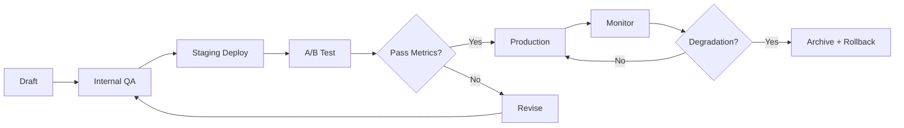

# 🔧 AI Model Management & Version Control

**Last Updated:** February 17, 2026  
**Owner:** CTO & AI Lead  
**Review Cycle:** Quarterly (before major model updates)

---

## 🎯 PURPOSE

Nzila's AI infrastructure runs on Azure OpenAI (GPT-4, GPT-4 Turbo) with 200+ proprietary prompts powering the **Companion Engine** across 12+ platforms. This document defines **model selection, version control, rollback procedures, and prompt lifecycle management** to ensure consistency, safety, and auditability.

---

## 📋 MODEL INVENTORY

### **Current Production Models** (February 2026)

| Model | Version | Deployment | Use Case | Platforms |
|-------|---------|------------|----------|-----------|
| **GPT-4** | gpt-4-0613 | Azure OpenAI Canada East | Long-form coaching, case analysis, complex reasoning | ABR Insights, Union Eyes |
| **GPT-4 Turbo** | gpt-4-1106-preview | Azure OpenAI Canada East | Fast interactive responses, daily check-ins, nudges | Memora, CareAI, FamilySync |
| **GPT-3.5 Turbo** | gpt-3.5-turbo-0125 | Azure OpenAI Canada East | Fallback for high-volume, low-complexity prompts | CORA (farm advisory), Trade OS |
| **text-embedding-ada-002** | text-embedding-ada-002-v2 | Azure OpenAI Canada East | Semantic search, context retrieval, prompt similarity | All platforms (pgVector integration) |

### **Model Selection Criteria**

| Criterion | GPT-4 | GPT-4 Turbo | GPT-3.5 Turbo |
|-----------|-------|-------------|---------------|
| **Reasoning Complexity** | HIGH (multi-step logic, legal/union case analysis) | MEDIUM (interactive coaching) | LOW (FAQ, simple recommendations) |
| **Context Window** | 8K tokens | 128K tokens | 16K tokens |
| **Latency Tolerance** | 3-10 seconds | 1-3 seconds | <1 second |
| **Cost Sensitivity** | $0.03/1K input, $0.06/1K output | $0.01/1K input, $0.03/1K output | $0.0005/1K input, $0.0015/1K output |
| **Use Case Examples** | ABR CanLII case analysis, Union Eyes grievance prediction | Memora daily check-ins, CareAI respite planning | CORA crop recommendations, simple FAQs |

---

## 🔄 VERSION CONTROL & ROLLBACK

### **Model Version Tracking**

**All model versions are tracked in Azure OpenAI deployment configurations:**

```yaml
# Example: Memora Companion Production Configuration
model:
  name: "gpt-4-turbo"
  version: "gpt-4-1106-preview"
  deployment_name: "memora-companion-prod"
  region: "canadaeast"
  created_date: "2025-12-15"
  updated_date: "2026-01-20"
  rationale: "Upgraded from GPT-4 to GPT-4 Turbo for 50% latency reduction, 128K context window for longer user histories"
  rollback_target: "gpt-4-0613" # Previous stable version
```

**Change Log Maintained in:**
- `ai/model-changelog.md` (version history, upgrade rationale, performance comparisons)
- Azure OpenAI deployment logs (audit trail)
- Jira tickets (change requests, performance regressions, rollback triggers)

### **Rollback Protocol**

**Trigger Conditions** (any one requires immediate rollback):
1. ✅ **Latency >5 seconds** for 95th percentile user interactions (SLA breach)
2. ✅ **Error rate >5%** (hallucinations, refusals, harmful content detected)
3. ✅ **User satisfaction drop >15%** (measured via in-app feedback thumbs up/down)
4. ✅ **Azure AI Content Safety flags >2% of outputs** (toxicity, PII leakage)
5. ✅ **Cost increase >50%** vs. previous 30-day baseline (unexpected token usage)

**Rollback Steps**:
1. **Immediate**: Switch Azure OpenAI deployment to previous stable version (< 5 minutes via deployment config update)
2. **Notify**: Post to #ai-incidents Slack channel (CTO, AI Lead, Platform Leads)
3. **Document**: Jira incident ticket (symptoms, root cause analysis, rollback decision)
4. **Review**: AI Governance Council convenes within 48 hours (CTO, Legal, Clinical Lead, Product)
5. **Postmortem**: 7-day retrospective (update model selection criteria, add regression tests)

**Rollback Permissions**:
- CTO: Unrestricted (can rollback any model anytime)
- AI Lead: Production models (requires CTO notification within 1 hour)
- Platform Leads: Staging models only (production requires AI Lead approval)

---

## 📝 PROMPT VERSION CONTROL

### **Prompt Library Structure**

**200+ GPT-4 prompts organized by:**
- **Domain**: healthtech, justice-equity, uniontech, agrotech, general
- **Tone**: warm (Memora), professional (ABR), motivational (Union Eyes), advisory (CORA)
- **User State**: new user (onboarding), active (engaged), lapsed (re-engagement), caregiver (family support)

**Example Prompt Metadata** (Django 5 Prompt Library ORM):

```python
# models/companion_prompt.py
class CompanionPrompt(models.Model):
    id = models.UUIDField(primary_key=True, default=uuid.uuid4)
    domain = models.CharField(max_length=50)  # healthtech, justice-equity, etc.
    tone = models.CharField(max_length=50)  # warm, professional, motivational
    user_state = models.CharField(max_length=50)  # new, active, lapsed
    prompt_template = models.TextField()  # Jinja2 template with {{variables}}
    version = models.IntegerField(default=1)  # Incremented on every edit
    created_at = models.DateTimeField(auto_now_add=True)
    updated_at = models.DateTimeField(auto_now=True)
    created_by = models.ForeignKey(User, on_delete=models.SET_NULL, null=True)
    status = models.CharField(max_length=20)  # draft, staging, production, archived
    approval_date = models.DateTimeField(null=True)  # When moved to production
    approved_by = models.ForeignKey(User, related_name="approved_prompts", on_delete=models.SET_NULL, null=True)
    ab_test_group = models.CharField(max_length=50, null=True)  # A/B testing variant identifier
    performance_metrics = models.JSONField(default=dict)  # {avg_rating, response_time, conversion_rate}
```

### **Prompt Lifecycle**



**Stage Definitions**:
1. **Draft**: Prompt authored by AI Lead, Product, or Platform Lead (stored in draft status)
2. **Internal QA**: 5+ test scenarios (edge cases, harmful inputs, PII handling)
3. **Staging Deploy**: Deployed to staging environment (internal team testing, 7 days)
4. **A/B Test**: Production deployment to 10% of users (compare vs. existing prompt, 14-30 days)
5. **Production**: Full rollout if A/B test shows ≥5% improvement in user satisfaction OR latency reduction
6. **Monitor**: Continuous tracking (Azure Application Insights, user feedback, safety flags)
7. **Archive**: Prompt deprecated if performance drops <baseline OR replaced by better variant

### **Prompt Approval Requirements**

**All production prompts require:**
- ✅ **AI Lead approval** (tone, voice, personalization accuracy)
- ✅ **Legal review** (PII handling, consent language, medical disclaimers for healthtech)
- ✅ **Clinical Lead approval** (healthtech prompts only: Memora, CareAI, WellLoop)
- ✅ **5+ QA test scenarios passed** (edge cases documented in Jira)
- ✅ **A/B test completion** (≥1,000 user interactions, ≥5% metric improvement)

**Exception**: Emergency fix prompts (harmful content detected, safety incident) can be deployed by CTO without A/B test, retroactive approval required within 24 hours.

---

## 🧪 A/B TESTING FRAMEWORK

### **Metrics Tracked**

| Metric | Threshold | Tool |
|--------|-----------|------|
| **User Satisfaction** | ≥5% improvement (thumbs up/down in-app) | Application Insights custom events |
| **Engagement Rate** | ≥3% increase (user responds vs. ignores nudge) | Drizzle ORM analytics queries |
| **Response Time** | ≤2 seconds (95th percentile) | Azure OpenAI telemetry |
| **Safety Flags** | <2% (harmful content, PII leakage) | Azure AI Content Safety API |
| **Cost per Interaction** | ≤10% increase vs. baseline | Azure billing analytics |

### **A/B Test Duration**

| Prompt Type | Minimum Duration | Minimum Interactions | Decision Criteria |
|-------------|------------------|---------------------|-------------------|
| **Daily Check-In** | 14 days | 2,000 interactions | User satisfaction + engagement rate |
| **Coaching/Learning** | 30 days | 1,000 interactions | Completion rate + NPS |
| **Nudge/Re-engagement** | 21 days | 1,500 interactions | Click-through rate + user retention |
| **Safety-Critical** | 45 days | 3,000 interactions | Zero safety flags + clinical approval |

---

## 🛡️ MODEL COMPLIANCE & GOVERNANCE

### **Regulatory Compliance**

| Model Use Case | Regulation | Compliance Check |
|----------------|------------|------------------|
| **Healthtech Prompts** (Memora, CareAI) | HIPAA, PIPEDA, Law 25 | PII detection (Azure AI Content Safety), audit logs, caregiver consent |
| **Justice-Equity** (ABR Insights) | GDPR, PIPEDA | CanLII case anonymization, bias audits, fairness testing |
| **Uniontech** (Union Eyes) | Labor law compliance (provincial) | Contract interpretation accuracy, grievance prediction explainability |
| **AgTech** (CORA) | Environmental data privacy | Farm data anonymization, carbon credit verification |

### **Bias & Fairness Audits**

**Quarterly Audits** (before major model updates):
1. **Demographic Representativeness**: Test prompts across age groups (18-30, 31-50, 51-70, 70+), languages (English/French), cognitive ability levels
2. **Cultural Sensitivity**: French Canadian tone vs. English Canadian, Indigenous community considerations
3. **Edge Case Performance**: Rare names, non-binary pronouns, low-literacy users
4. **Bias Detection**: Sentiment analysis across demographic groups (ensure no negative bias toward age/gender/ethnicity)

**Audit Results Logged in:**
- `ai/bias-audit-reports/` (quarterly PDF reports)
- AI Governance Council meeting notes
- Jira bias tickets (if issues detected, requires remediation before next release)

---

## 📊 PERFORMANCE MONITORING

### **Real-Time Dashboards** (Azure Application Insights)

| Metric | Alert Threshold | Action |
|--------|----------------|---------|
| **P95 Latency** | >5 seconds | Slack #ai-incidents, investigate model timeout |
| **Error Rate** | >5% | Auto-rollback to previous model version |
| **Safety Flags** | >2% | Disable prompt, escalate to AI Lead + Legal |
| **Cost per 1K tokens** | >50% increase vs. 30-day baseline | Investigate prompt token bloat, optimize context window |
| **User Satisfaction** | <70% thumbs up | A/B test new prompt variants |

### **Weekly Review Protocol**

**Every Monday 10am ET** (AI Lead, CTO, Platform Leads):
1. Review previous week's metrics (latency, error rate, user satisfaction, cost)
2. Identify underperforming prompts (satisfaction <70%, engagement <50%)
3. Prioritize A/B tests for upcoming week
4. Review safety incidents (if any)
5. Update model changelog (if version changes planned)

---

## 🔐 IP PROTECTION

### **Prompt Library Access Control**

**200+ GPT-4 prompts = $80K+ trade secret (🔴 HIGH protection)**

**Access Tiers**:
1. **Full Access** (view + edit + deploy): CTO, AI Lead only (2 people)
2. **Read-Only Access** (view prompts, no edit): Platform Leads, Senior Engineers (5-7 people, NDA required)
3. **No Access**: Contractors, Junior Engineers (must request specific prompts via Jira, approved case-by-case)

**Security Measures**:
- ✅ GitHub private repo (`nzila-ai-private`) with branch protection (CTO + AI Lead approval for production merges)
- ✅ Django 5 Row-Level Security (RLS) policies (only authorized users can query production prompts)
- ✅ Quarterly audit (Legal + Ops review access logs, revoke stale permissions)
- ✅ NDA enforcement (all employees, contractors, pilot partners with prompt exposure)

---

## 📅 RELEASE SCHEDULE

### **Model Update Cadence**

| Update Type | Frequency | Approval Required | Downtime |
|-------------|-----------|-------------------|----------|
| **Major Model Upgrade** (GPT-4 → GPT-5) | Annually or when Azure releases | AI Governance Council (CTO, Legal, Clinical, Product) | <5 minutes (deployment switch) |
| **Minor Version Update** (gpt-4-0613 → gpt-4-0125) | Quarterly (Azure release cycle) | AI Lead + CTO | <5 minutes |
| **Prompt Updates** (individual prompts) | Weekly (production deployments every Friday 6pm ET) | AI Lead approval (CTO for safety-critical) | Zero downtime (A/B test rollout) |
| **Emergency Rollback** | As needed (safety incidents) | CTO unrestricted, AI Lead requires CTO notification | <5 minutes |

---

## ✅ CHECKLIST: New Model Deployment

**Before deploying a new model version (e.g., GPT-4 → GPT-4 Turbo):**

- [ ] Azure OpenAI deployment created in staging (canadaeast region)
- [ ] 10+ test scenarios passed (edge cases, hallucinations, harmful content, PII)
- [ ] Latency benchmarked (P50, P95, P99 vs. previous model)
- [ ] Cost analysis (token usage, API pricing, 30-day projection)
- [ ] A/B test plan approved (10% traffic, 14-30 day duration, success metrics defined)
- [ ] Rollback target identified (previous stable version deployment name)
- [ ] AI Governance Council approval (CTO, Legal, Clinical Lead, Product)
- [ ] Production deployment scheduled (Friday 6pm ET, low-traffic window)
- [ ] Monitoring dashboard configured (Azure Application Insights custom alerts)
- [ ] Team notification (Slack #ai-releases, email to Platform Leads)
- [ ] Documentation updated (model-changelog.md, deployment configs, integration guides)

---

**© 2026 Nzila Ventures. Confidential & Proprietary.**  
*Trade Secret: Prompt Library v1 (200+ prompts, $80K+ value)*
