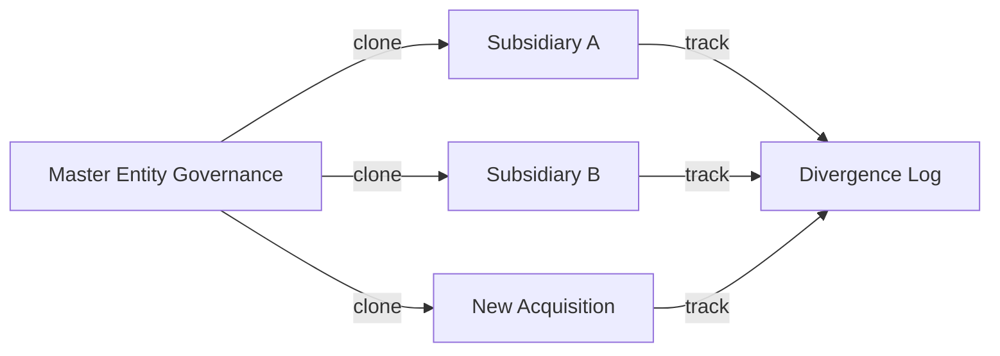
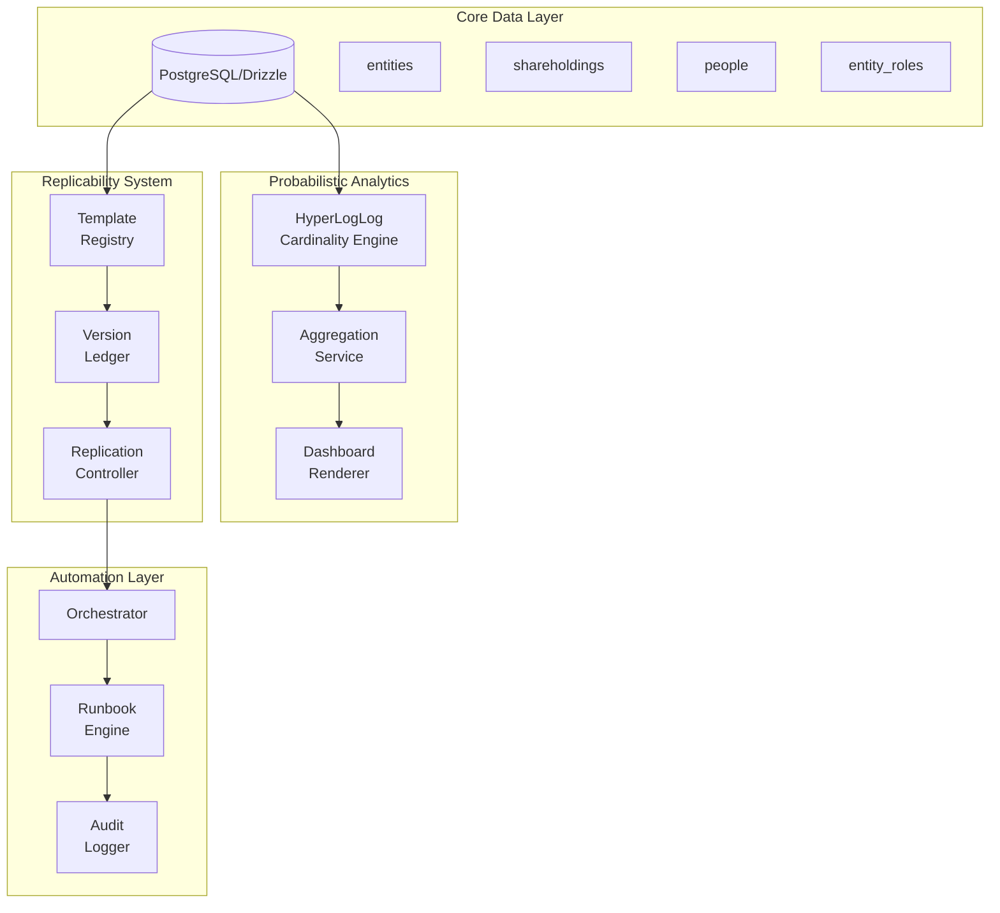

# Probabilistic Cardinality & Replicability Notation in Nzila OS

## Executive Summary

After analyzing your Nzila Business OS ecosystem, I found no existing implementation of probabilistic cardinality or replicability notation. These concepts can significantly enhance your analytics, automation, and governance operations.

---

## 1. Probabilistic Cardinality

### What It Is
Probabilistic cardinality estimates the number of distinct elements in a dataset without storing all elements. The most common algorithm is **HyperLogLog (HLL)**, which can count billions of unique items using minimal memory (~12KB for 2^64 elements with <2% error).

### Current Analytics Gaps
From examining [`packages/analytics/portfolio/entity_consolidation.py`](packages/analytics/portfolio/entity_consolidation.py:1), your portfolio tracks:
- 4,773 entities in Union Eyes
- 132 entities in ABR Insights
- Cross-platform entity type mapping

### Use Cases in Your Ecosystem

#### A. Entity & Shareholder Counting
| Current Approach | Probabilistic Enhancement |
|------------------|---------------------------|
| `SELECT COUNT(DISTINCT shareholder_id) FROM holdings` | HyperLogLog for O(1) memory across millions of shareholders |
| Manual cross-entity deduplication | HLL merge across entity boundaries |

**Implementation Location**: [`apps/console/lib/equity/models.ts`](apps/console/lib/equity/models.ts:1) - extend equity models with cardinality estimators

#### B. Portfolio Analytics (Existing Dashboards)
Your [`PORTFOLIO_HEALTH.json`](packages/analytics/dashboards/PORTFOLIO_HEALTH.json:1) tracks entity counts per platform. HLL would enable:
- Real-time unique user counts across all verticals
- Distinct shareholder deduplication across entities
- Memory-efficientrollups for dashboards

#### C. Automation Systems
In [`packages/automation/orchestrator.py`](packages/automation/orchestrator.py:32), HLL could track:
- Unique service dependencies across migrations
- Distinct API endpoints consumed
- Cross-platform entity reuse detection

### Technical Implementation

```typescript
// New file: packages/analytics/src/cardinality.ts
import HyperLogLog from 'hyperlib';

interface CardinalityEstimator {
  add(item: string): void;
  count(): number;
  merge(other: CardinalityEstimator): void;
}

// For shareholder uniqueness across entities
const shareholderHLL = new HyperLogLog(12); // 12 bits = ~2% error
for (const entity of entities) {
  for (const holder of entity.shareholders) {
    shareholderHLL.add(holder.legalName + holder.email);
  }
}
console.log(`Unique shareholders: ${Math.round(shareholderHLL.count())}`);
```

---

## 2. Replicability Notation

### What It Is
Replicability notation is a formal system for describing how data, templates, and processes can be consistently reproduced across entities. It includes:
- Versioned templates with change tracking
- Provenance chains (origin → copies)
- Reproducibility metadata

### Current State
Your governance system already has:
- [`governance/workflows.ts`](apps/console/lib/governance/workflows.ts:1) - ApprovalWorkflowSchema
- [`governance/policy-engine.ts`](apps/console/lib/governance/policy-engine.ts:1) - Policy evaluation
- Runbooks in [`ops/ops/`](ops/ops/README.md:1) - SOC-style operational procedures

### Use Cases in Your Ecosystem

#### A. Governance Template Replication


**Implementation**: Extend [`ApprovalWorkflowSchema`](apps/console/lib/governance/workflows.ts:21) with replication metadata:
```typescript
const ReplicableWorkflowSchema = z.object({
  ...ApprovalWorkflowSchema.shape,
  replicationId: z.string().uuid(),
  templateVersion: z.string(),
  sourceEntityId: z.string().uuid().optional(),
  divergenceLog: z.array(z.object({
    field: z.string(),
    original: z.unknown(),
    current: z.unknown(),
    changedAt: z.string().datetime(),
    changedBy: z.string().uuid()
  }))
});
```

#### B. Equity Structure Templates
Your [`equity/models.ts`](apps/console/lib/equity/models.ts:18) defines ShareClass enums. Replicability would enable:
- Cloning share class structures between entities
- Tracking template lineage (which entity was the "template")
- Auditing divergence from standard structures

#### C. Runbook Replication Across Entities
From [`ops/ops/compliance/Required-Evidence-Map.md`](ops/ops/compliance/Required-Evidence-Map.md:1), you capture evidence metadata:
- `entity_id`, `artifact_id`, `blob_path`, `sha256`

Replicability notation would add:
- `template_source_id` - which runbook this was cloned from
- `replication_version` - template version at clone time
- `customization_delta` - what was modified

#### D. Automation Orchestrator
Your [`MigrationOrchestrator`](packages/automation/orchestrator.py:32) could use replicability to:
- Track which migration templates are "blessed" (replication sources)
- Audit which entities used which template versions
- Enable "template updates" that propagate to child entities

---

## 3. Integration Architecture



---

## 4. Implementation Roadmap

### Phase 1: Probabilistic Cardinality
- [ ] Add `hyperloglog` dependency to [`apps/console/package.json`](apps/console/package.json)
- [ ] Create `packages/analytics/src/cardinality` module
- [ ] Implement shareholder uniqueness estimator
- [ ] Add HLL metrics to portfolio dashboards

### Phase 2: Replicability Notation
- [ ] Extend governance schemas with replication metadata
- [ ] Create template registry in database
- [ ] Implement clone/copy operations for workflows
- [ ] Add divergence tracking

### Phase 3: Automation Integration
- [ ] Add template versioning to orchestrator
- [ ] Implement runbook templating system
- [ ] Add replication audit trails

---

## 5. Key Files to Modify

| File | Change Type |
|------|-------------|
| [`apps/console/lib/equity/models.ts`](apps/console/lib/equity/models.ts:1) | Add cardinality estimators |
| [`apps/console/lib/governance/workflows.ts`](apps/console/lib/governance/workflows.ts:1) | Add replication schema |
| [`packages/analytics/portfolio/entity_consolidation.py`](packages/analytics/portfolio/entity_consolidation.py:1) | Add HLL for entity counting |
| [`packages/automation/orchestrator.py`](packages/automation/orchestrator.py:32) | Add template registry |
| [`ops/ops/compliance/Required-Evidence-Map.md`](ops/ops/compliance/Required-Evidence-Map.md:1) | Document replicability metadata |

---

## 6. Benefits

| Concept | Benefit | Metric |
|---------|---------|--------|
| Probabilistic Cardinality | Memory-efficient counting | 12KB vs millions of rows |
| Replicability Notation | Audit-ready governance | Full provenance chains |
| Combined | Scalable portfolio analytics | O(n) → O(1) for uniqueness |
