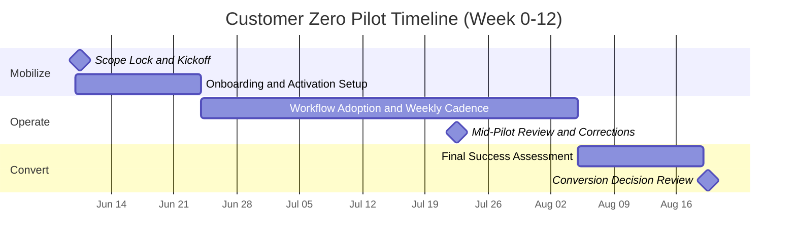

# Union Eyes — Brandon Board Packet (Customer Zero Pilot)

Date: 2026-06-02
Audience: Executive board, sponsor, pilot lead, decision stakeholders
Purpose: Single packet for internal review, pilot approval, and 90-day conversion path alignment.

---

## 1. Decision Summary

Primary decision:
Approve a fixed 90-day Union Eyes pilot to validate steward and leadership workflow improvement under bounded scope.

Commercial terms:
1. Fixed pilot engagement.
2. 100% pilot fee credit-forward on annual conversion.

Scope posture:
1. Customer Zero discipline applies.
2. Tier 1 friction-driven improvements are in scope.
3. Tier 2 and Tier 3 expansion items are deferred.

---

## 2. Problem and Rationale

Current operational pain points:
1. Fragmented case and document tracking.
2. Inconsistent follow-up visibility across active issues.
3. Reliance on personal memory instead of durable records.
4. Limited executive-level operational signal for timely decisions.

Pilot rationale:
1. Run a bounded, evidence-driven trial.
2. Measure real workflow improvement before annual commitment.
3. Preserve low-risk optionality (proceed, extend, or close) at day 90.

---

## 3. What Union Eyes Delivers In Pilot

Core pilot value:
1. Centralized workflow context for steward and leadership operations.
2. Better lifecycle visibility and follow-up discipline.
3. Durable operational memory for events, blockers, and lessons.
4. Structured pilot scoring and readiness signal for decision confidence.

Pilot objective:
Measurable operational improvement, not broad platform transformation.

---

## 4. Pilot Snapshot (One Page)

1. Duration: 90 days (Week 0 to Week 12).
2. Scope: Bounded workflow deployment with explicit in-scope and out-of-scope criteria.
3. Operating model: Weekly cadence with midpoint correction and final decision package.

Responsibilities:

Union Eyes:
1. Setup and activation support.
2. Onboarding and checklist guidance.
3. Weekly metrics and friction review.
4. End-of-pilot recommendation package.

Customer team:
1. Executive sponsor assignment.
2. Pilot lead assignment.
3. Weekly participation and blocker resolution.
4. Timely operational feedback.

---

## 5. Success Metrics and Decision Logic

Primary scoring dimensions:
1. Pilot Fit Score.
2. Pilot Readiness Score.
3. Pilot Revenue Score.
4. Pilot Strategic Value Score.
5. Pilot Risk Score.
6. Overall Opportunity Score and Tier.

Operational signals:
1. Adoption.
2. Activity.
3. Champion strength.
4. Risk trend.
5. Renewal and expansion likelihood.

Decision at pilot close:
1. Successful -> annual conversion with 100% pilot fee credit-forward.
2. Partial -> constrained remediation extension.
3. No fit -> structured closeout.

---

## 6. 90-Day Timeline (Week 0-12)

Week-by-week:
1. Week 0: scope lock, owners, success criteria.
2. Weeks 1-2: activation and first steward workflows live.
3. Weeks 3-8: weekly operations review plus midpoint correction.
4. Weeks 9-12: final assessment and proceed/extend/close decision.

---

## 7. FAQ and Objection Handling

1. "Do we already have this in Union365?"
Pilot is not rip-and-replace. It validates workflow continuity and operational visibility in a bounded setting.

2. "Is this replacing existing systems now?"
No. Replacement decisions are separate and only considered after pilot evidence is reviewed.

3. "How much effort is needed from our side?"
Named sponsor + pilot lead + weekly review participation + timely blocker feedback.

4. "What data is needed to start?"
Core org profile, priority workflows, basic role setup, and hard constraints.

5. "How is success measured?"
Objective score dimensions plus week-over-week operational signal.

6. "What happens after 90 days?"
Proceed, constrained extension, or closeout based on evidence.

7. "Are we locked after pilot?"
No automatic lock-in. Pilot is bounded decision phase.

8. "What if friction appears mid-pilot?"
Friction is treated as signal and resolved in weekly cadence with intervention tracking.

---

## 8. Customer Zero Scope Governance (Internal)

Tier 1 (implement now):
1. Pricing and offer clarity consistency.
2. Proposal package completeness.
3. Operational pilot review reliability.
4. Executive package export reliability.
5. Steward workflow friction fixes from live usage.

Tier 2 (queue):
1. Extra reporting layers.
2. Additional exports beyond current package.
3. Broader role-type granularity.
4. Extra dashboard widgets.

Tier 3 (freeze):
1. New governance engines.
2. New doctrine modules.
3. New scoring frameworks beyond current C1.5 model.
4. New intelligence abstractions.
5. New commercialization subsystems.

Sprint gate:
1. What observed friction does this solve?
2. Which pilot KPI should move?
3. Which tier is this item?
4. If not Tier 1, why is it in this sprint?

---

## 9. Immediate Next Actions

1. Confirm sponsor and pilot lead.
2. Approve pilot scope and kickoff date.
3. Issue pilot packet to board members.
4. Start Week 0 activation checklist.
5. Schedule Week 2 signal review and Week 6 midpoint correction.
