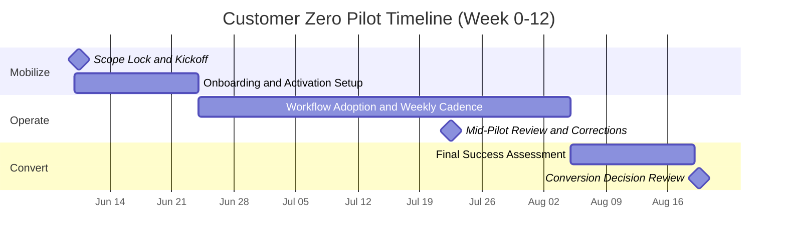

# Union Eyes — Sample Pilot Timeline (Week 0-12)

Audience: Executive and operational stakeholders
Date: 2026-06-02

---

## Timeline Overview

---

## Week-by-Week Summary

### Week 0 (Kickoff)
1. Confirm scope, owners, success metrics, and decision timeline.

### Weeks 1-2 (Mobilize)
1. Activate pilot workspace and onboarding checklist.
2. Start first steward workflows.

### Weeks 3-8 (Operate)
1. Run weekly operations review.
2. Track adoption, activity, blockers, and intervention outcomes.
3. Execute midpoint course correction.

### Weeks 9-12 (Convert)
1. Evaluate outcomes against agreed success criteria.
2. Finalize proceed/extend/close decision package.
3. If proceed: transition with full pilot-fee credit-forward.
